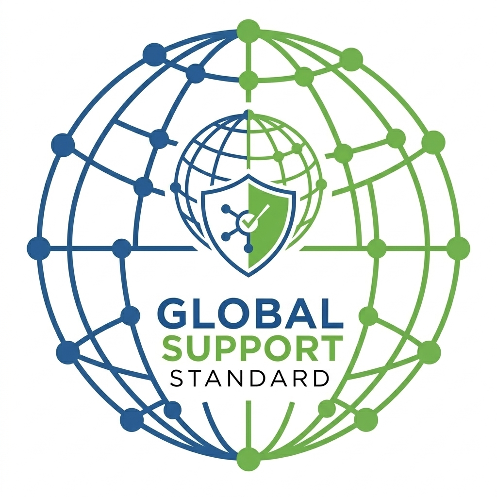
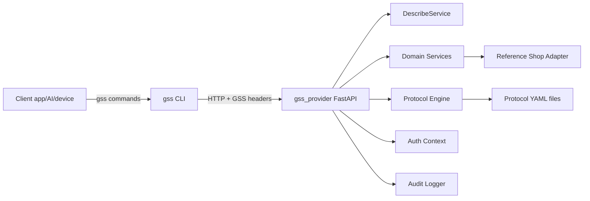

# Global Support Standard (GSS)

Open protocol for machine-readable e-commerce support.



[](https://github.com/Global-Support-Standard/global-support-standard/actions/workflows/ci.yml)
[](LICENSE)
[](pyproject.toml)

GSS lets any app, AI agent, or device resolve customer support requests directly with a shop using a consistent command model:

```bash
gss <shop> <domain> <action> [--flags]
```

This repository includes a Python reference implementation of the protocol and supporting project docs.

## Why GSS

Most support requests are policy execution, not free-form conversation:

- "Where is my package?"
- "Can I return this item?"
- "Why is my refund delayed?"
- "Can you show my account audit trail?"

Today these flows are reimplemented per shop and routed through human agents. GSS standardizes these operations so support can be:

- Faster (seconds, not days)
- Consistent across shops
- Safer for automation (action levels, confirmation tokens, auditability)
- Consumer-agnostic (AI, mobile app, browser extension, device)

## Repository At A Glance

| Area | Purpose |
|---|---|
| `src/gss_provider` | FastAPI provider server (shop-facing implementation) |
| `src/gss_cli` | Typer CLI consumer (`gss` command) |
| `src/gss_core` | Shared models, envelope helpers, and error contracts |
| `protocols/` | Protocol format docs and runnable YAML examples |
| `providers/mock_shop` | Example consumer-policy configuration |
| `sdk/typescript` | TypeScript SDK scaffold (non-blocking roadmap) |
| `spec/` | Protocol/spec narrative and architecture references |
| `docs/` | Getting-started docs for shops and consumers |
| `tests/` | API and CLI integration tests |

## Reference Implementation Scope

This codebase currently ships an end-to-end production baseline:

- Provider API with standardized response envelope
- CLI with `gss <shop> <domain> <action>` routing
- Local reference adapter/data layer
- Protocol engine (YAML rules + context enrichment)
- Security baseline:
  - Customer auth token flow
  - Required `GSS-Consumer-*` headers
  - Two-step request execution (`returns initiate` -> `returns confirm`)
  - Append-only audit log records
- Stateless core boundary:
  - Framework defines contracts and orchestration
  - Shops own persistence/secret storage in adapter implementations

## Architecture



## Quickstart

### 1) Install

```bash
python -m venv .venv
source .venv/bin/activate
pip install -e ".[dev]"
```

### 2) Start provider

```bash
gss-provider
```

Default endpoint: `http://127.0.0.1:8000/v1`

### 3) Run consumer flow

```bash
gss mockshop.local describe
gss mockshop.local auth login --method api_key --customer-id CUST-001
gss mockshop.local orders list
gss mockshop.local orders get --id ORD-1001
gss mockshop.local shipping track --order-id ORD-1001
gss mockshop.local protocols get --trigger delivery-not-received --context '{"order_id":"ORD-1002","days_since_expected":1}'
gss mockshop.local returns initiate --order-id ORD-1001 --item-id ITEM-1 --reason defective
gss mockshop.local returns confirm --token <confirmation_token>
gss mockshop.local account audit-log
```

Optional token behavior:
- default: CLI stores token locally in `~/.gss/tokens.json`
- disable local storage: `GSS_STORE_TOKENS=0`
- provide token explicitly: `GSS_CUSTOMER_TOKEN=<token>`

### Shopify webshop project (inside this repo)

```bash
gss-shopify-provider
```

See `webshop/shopify-test-store/README.md` for setup against your test store.
The Shopify reference project includes an agent-first auth flow (`auth verify-customer` -> `auth issue-token`) in addition to legacy compatibility login.

## HTTP Endpoints

### Discovery
- `GET /v1/describe`
- `GET /v1/{domain}/describe`

### Auth
- `POST /v1/auth/login`

### Domains
- `GET /v1/orders`
- `GET /v1/orders/{order_id}`
- `GET /v1/shipping/track/{order_id}`
- `POST /v1/returns/check-eligibility`
- `POST /v1/returns/initiate`
- `POST /v1/returns/confirm`
- `POST /v1/protocols/get`
- `GET /v1/account/audit-log`

## Security Model Highlights

- Every protected request requires:
  - `Authorization: Bearer <token>`
  - `GSS-Consumer-Id`
  - `GSS-Consumer-Type`
  - `GSS-Version`
- `request` actions are two-step by design (issue confirmation token, then confirm)
- Authorization is customer-scoped and domain actions enforce ownership checks
- Request/action events are recorded to the audit log
- Trust signaling:
  - `describe` includes compliance metadata (`level`, `certified`, `test_suite_version`)
  - CLI warns when a shop is uncertified or missing compliance metadata

## Production Minimum Config

For production deployments, minimum baseline should include:

- Auth + headers on protected calls:
  - `Authorization: Bearer <token>`
  - `GSS-Consumer-Id`
  - `GSS-Consumer-Type`
  - `GSS-Version`
- Token policy:
  - short-lived access tokens (recommended 5-60 minutes)
  - least-privilege scopes per domain/action level
  - optional binding to consumer identity (`GSS-Consumer-Id`)
- Data guardrails:
  - validate identifiers server-side
  - enforce customer ownership checks before returning payloads
  - fail closed (`VALIDATION_ERROR`/`FORBIDDEN`)
- Action controls:
  - `request` actions with two-step confirmation
  - `critical` actions with out-of-band verification
- Governance and CI:
  - branch protection on `main`
  - required checks: lint, tests matrix, coverage, package-check, dependency-audit
  - CODEOWNERS and PR template enabled

## Trust Boundary

GSS defines protocol contracts and package logic. Shop implementations own operational security and persistence (token systems, session stores, audit infrastructure).  
See `docs/compliance-and-trust.md` for full guidance.

## Testing

```bash
pytest
```

Current test coverage includes:

- happy-path API flows
- forbidden cross-customer order access
- missing header rejection
- protocol enrichment behavior
- CLI integration for login, listing orders, and two-step returns

## Documentation

- Spec overview: `spec/overview.md`
- Architecture deep dive: `docs/architecture.md`
- API request examples: `docs/api-examples.md`
- Commands reference: `docs/commands-reference.md`
- Compliance/trust boundary: `docs/compliance-and-trust.md`
- Authorization model: `docs/authorization-model.md`
- Agent delegation model: `docs/agent-delegation-model.md`
- Multi-language roadmap: `docs/multi-language-roadmap.md`
- Repository governance: `docs/repository-governance.md`
- Cloud Run deployment: `docs/deploy-cloud-run.md`
- Registry security spec: `docs/registry-security.md`
- Registry conformance checklist: `docs/registry-conformance-checklist.md`
- Conformance schema: `schemas/conformance/agent-delegation-checklist.json`
- Shopify webshop project: `webshop/shopify-test-store/README.md`
- Shop onboarding: `docs/getting-started-shops.md`
- Consumer onboarding: `docs/getting-started-consumers.md`
- Protocol format: `protocols/FORMAT.md`

## Contributing

See `CONTRIBUTING.md` for contribution expectations.

## License

This project is licensed under the terms in `LICENSE`.
