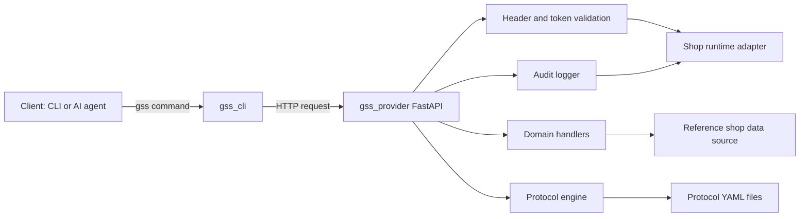
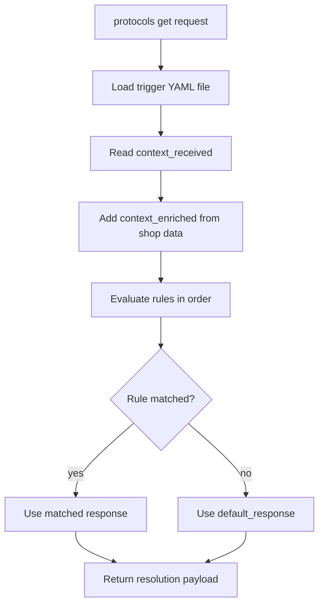

# GSS Reference Architecture

This document explains how the Python reference implementation is structured, how requests flow through the system, and where to extend the implementation.

The current architecture treats GSS as a stateless orchestration layer: webshop implementations own token/audit/confirmation persistence behind adapter contracts.

## System Components

## Request Lifecycle

1. Client executes a command such as `gss mockshop.local orders list`.
2. CLI resolves provider endpoint and injects required GSS headers.
3. Provider validates:
   - `Authorization` token
   - `GSS-Consumer-Id`
   - `GSS-Consumer-Type`
   - `GSS-Version`
4. Domain handler executes business logic (orders/shipping/returns/protocols).
5. Provider returns standard response envelope:
   - `status`
   - `data` or `error`
   - `meta.request_id`

## Module Map

| Module | Responsibility |
|---|---|
| `src/gss_core/models.py` | Shared models and enums for request/response contracts |
| `src/gss_core/errors.py` | Typed domain errors and status code mapping |
| `src/gss_core/envelope.py` | Uniform success/error response formatting |
| `src/gss_provider/app.py` | HTTP route definitions and endpoint wiring |
| `src/gss_provider/auth.py` | Header validation and auth-context construction via adapter |
| `src/gss_provider/mock_data.py` | Reference in-memory order/return datasets and helpers |
| `src/gss_provider/contracts.py` | Stateless adapter contracts for auth/confirm/audit |
| `src/gss_provider/mock_adapter.py` | In-memory reference implementation of shop contracts |
| `src/gss_provider/protocol_engine.py` | YAML protocol loading and rule evaluation |
| `src/gss_provider/audit.py` | Audit event helpers delegating to adapter contracts |
| `src/gss_cli/main.py` | CLI command parsing, auth persistence, HTTP transport |

## Protocol Evaluation Flow

Rule behavior in the reference implementation:
- First matching rule wins.
- Conditions support exact values and basic comparators (`gte`, `lte`, `eq`).
- Output includes both `context_received` and `context_enriched`.

## Security In Reference Implementation

- Protected endpoints require a valid bearer token.
- Consumer identity/type headers are mandatory.
- `returns initiate` is modeled as a `request` action:
  - returns `pending_confirmation` + `confirmation_token`
  - must be finalized by `returns confirm`
- Actions are appended through the audit contract for traceability.

## Extension Points

To evolve from the default reference adapter to production adapters:

1. Implement webshop-specific production adapters (e.g., Redis/Postgres/IdP-backed) for auth/confirmation/audit contracts.
2. Replace the local reference data adapter with platform adapters (Shopify, WooCommerce, custom).
3. Add richer protocol condition syntax (boolean ops, nested expressions, priorities).
4. Implement rate limiting and scope-based authorization.
5. Expand domains toward full standard coverage.
